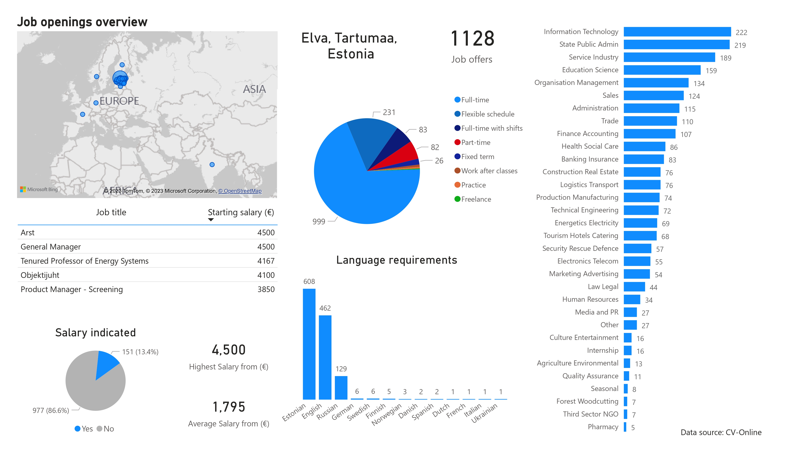

# Job postings scraping and visualization
This project focuses on web scraping for job postings from CV-Online using the Beautiful Soup library. The objective was to extract the following information: job title, company's name, location, application deadline, work type, language requirements, and salary (if available). Once the data has been gathered and processed, it was visualized using Power BI. The visualization showcases the vacancies data as of July 2nd, 2023.
